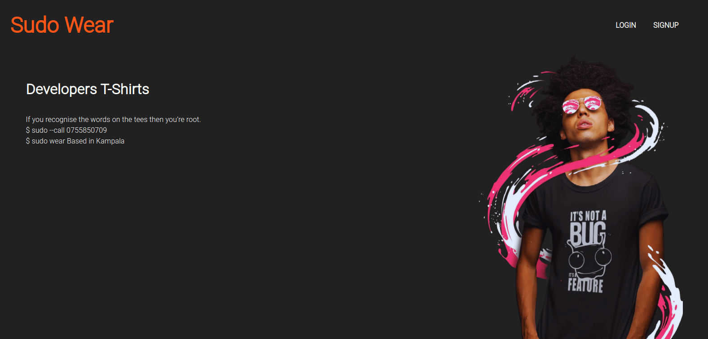

  <h2 align="center">Sudo Wear</h2>
  
A react-redux single page responsive application, where user can see the details of developer t-shirts and can add it to favourite. A user needs to sign up and login to view t-shirt details.

* 

<!-- TABLE OF CONTENTS -->
## Table of Contents

* [About the Project](#about-the-project)
* [Installation](#installation)
* [Test](#test)
* [Live Link](#Live-Link)
* [Built With](#built-with)
* [Nice to have features](#nice-to-have-features)
* [Potential Future Updates](#potential-future-updates)
* [Contact](#authors)
* [Acknowledgements](#acknowledgments)

<!-- ABOUT THE PROJECT -->
## About The Project

My Developer T-shirt Web App for selling developer T-shirts. A user can sign up/login to see the details of the T-shirt and add to favourite.

App uses react router to route to different components. 
Backend APIs are developed with Ruby on Rails. [Click here](https://github.com/oxenprogrammer/developer-wear/tree/feature/sudowear) to see backend project details.

<!-- Live Link  -->

## Live Link

[Click here](https://sudowear.netlify.app/) to see live version

<!-- INSTALLATION -->

## Installation

To run the app locally, clone the repository, navigate to it's directory.

#### Follow these commands step by step:-

git clone `https://github.com/oxenprogrammer/developer-wear-react.git` 

cd developer-wear-react  

npm install  

npm run start  

Now go to [localhost:3000](http://localhost:3000) in your browser.

**Note**
- You will need the backend running locally if you're to run the project in your machine. Checkout the backend setup.

<!-- Test -->

## Test

To run unit test run `npm run test` in root directory.

<!-- BUILD WITH -->

## Built With

- HTML/CSS
- React
- Redux
- React Router
- Material UI
- CSS Modules
- Axios
- Eslint
- Stylelint
- ES6
- NPM
- Font-Awesome
- Netlify for Live version deployment

<!-- Nice to have features -->

## 'Nice to have features' that are implemented
- User authentication using JWT
- Responsive to mobile and desktop screens
- Custom Notification

<!-- potential future updates -->

## Potential Future Updates

- Ability to Add to Cart
- Order T-Shirt
- Integration of Payment API like Mobile Money, PayPal, and Visa.s
- Server Side Rendering

<!-- CONTACT -->
## Authors
👤 **Emanuel Okello**

- GitHub: [oxenprogrammer](https://github.com/oxenprogrammer)
- Twitter: [@ox_emmy](https://twitter.com/ox_emmy)
- LinkedIn: [Emanuel Okello](https://www.linkedin.com/in/emanuel-okello/)

<!-- acknowledgments -->

## 🤝 Contributing

Contributions, issues and feature requests are welcome!

Feel free to check the [issues page](https://github.com/oxenprogrammer/developer-wear-react/issues).

## Acknowledgments

- [ Alexey Savitskiy](https://www.behance.net/gallery/37706679/Circle-(Landing-page-Dashboard-Mobile-App)) for design
- [Microverse](https://microverse.org)

## Show your support

Give a ⭐️ if you like this project!

## 📝 License

This project is [MIT](./LICENSE) licensed.